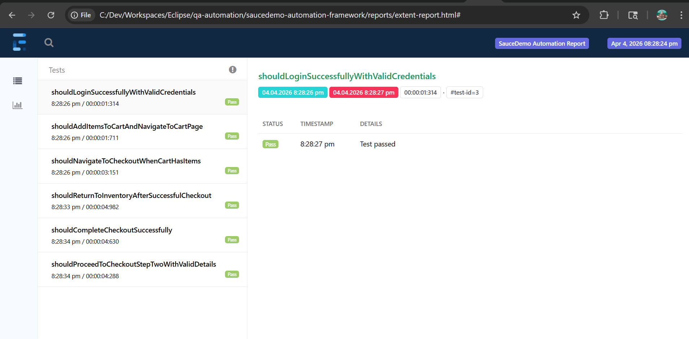
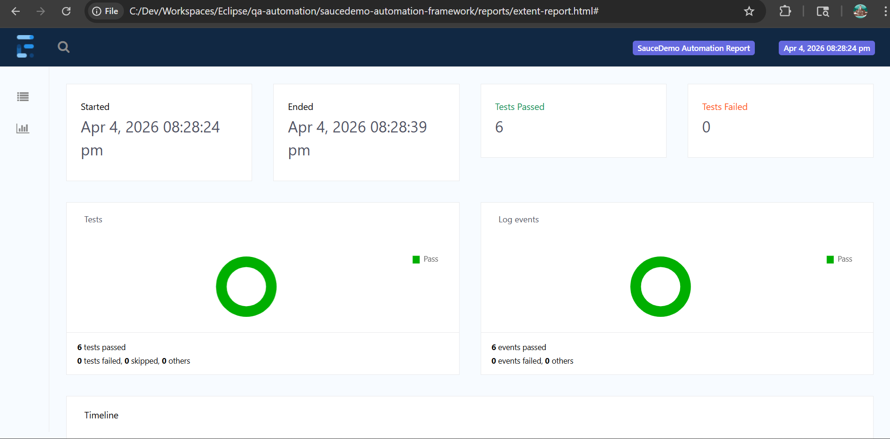
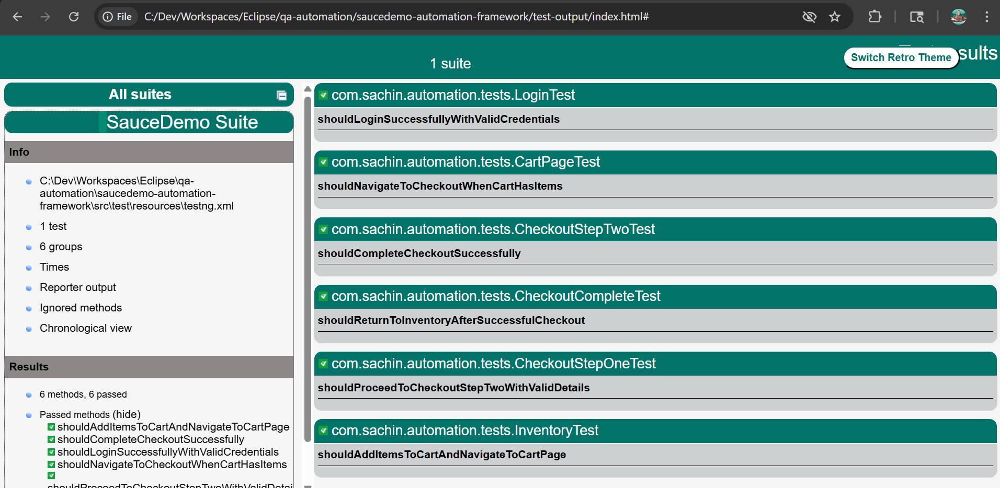

# 🚀 SauceDemo Automation Framework

This project is a Selenium-based automation framework built to test the SauceDemo web application.

Instead of just writing test scripts, the focus here was to design something closer to a real-world QA setup like clean structure, reusable components, proper reporting, and stable parallel execution.

---

## 🧰 Tech Stack

* Java
* Selenium WebDriver
* TestNG
* Maven
* Extent Reports
* Log4j2

---

## ⚙️ What’s implemented

* Page Object Model (POM) for better readability and maintenance
* Parallel execution using ThreadLocal WebDriver
* Extent Reports with detailed test logs and screenshots
* TestNG listeners for centralized reporting and logging
* Clean separation of test logic and page actions
* Grouping support (Smoke, Regression, Negative)

---

## 🧪 Test Coverage

The framework covers the core user journey of the SauceDemo application:

* Login functionality
* Adding items to cart
* Navigating to cart
* Checkout flow (step 1 & step 2)
* Order completion

---

## 📊 Test Reports

### 🔹 Extent Report

#### Dashboard



#### Test Details



---

### 🔹 TestNG Report



---

## ▶️ How to run the tests

```bash
mvn clean test
```

---

## 📁 Project Structure

```
src
 ├── main
 │   ├── base
 │   ├── driver
 │   ├── pages
 │   ├── reporting
 │   └── utils
 └── test
     └── tests
```

---

## 💡 Why this project

This framework was built to practice writing maintainable and scalable automation code — the kind you’d expect in a real QA environment, not just basic test scripts.

Focus areas were:

* Clean design
* Reusability
* Stability in parallel execution
* Readable test flow

---

## 👤 Author

Sachin Rathod
